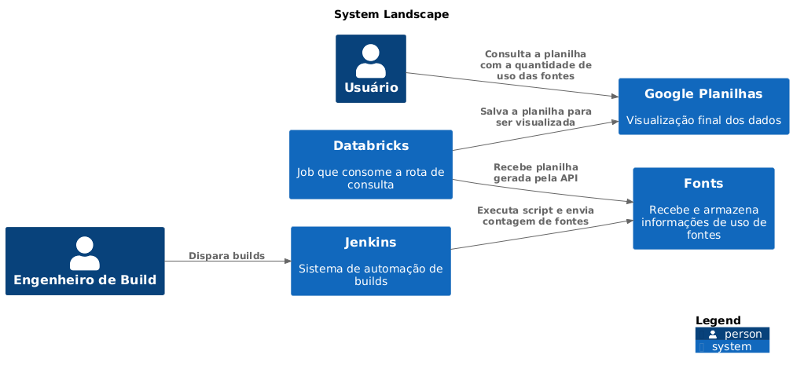
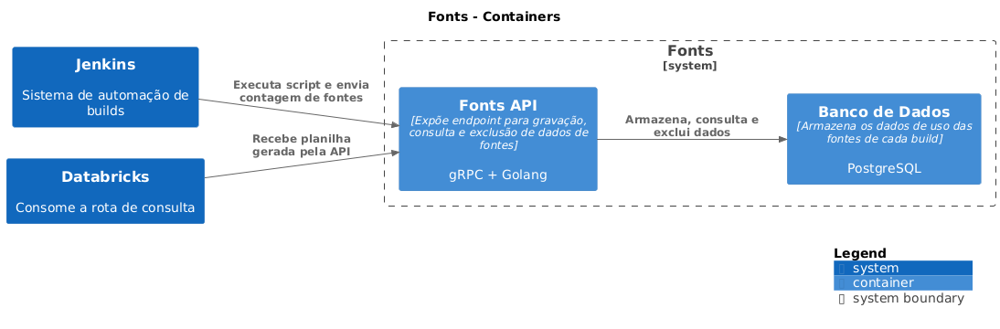

# Descrição Arquitetural – Sistema de Controle de Uso de Fontes em Builds

---

## Autores

Este documento foi produzido por **Roberto Pereira dos Santos Filho**

**Matrícula:** 121210587
**Contato:** roberto.santos.filho@ccc.ufcg.edu.br
**Projeto documentado:** repositório privado 
**Sistema:** Controle de Uso de Fontes em Builds

---

## Descrição Geral

Este documento descreve parte da arquitetura de um sistema responsável por **monitorar e controlar o uso de fontes licenciadas** durante o processo de build de aplicativos. A descrição segue o **modelo C4** e documenta os principais elementos arquiteturais envolvidos: atores, serviços, containers e informações tratadas.

Este sistema já foi implementado e está em produção.

---

## O Sistema de Monitoramento de Fontes

### Objetivo Geral

Controlar automaticamente o uso de fontes contratadas com número limitado de licenças durante builds de software, garantindo conformidade com contratos e auditoria contínua.

### Objetivos Específicos

- Obter contagem precisa de usos por fonte em cada build realizado.
- Armazenar essas contagens em um sistema centralizado.
- Tornar essas informações acessíveis e compreensíveis para equipes jurídicas e de compliance.
- Gerar relatórios atualizados e visualizações em planilhas acessíveis.

---

## Contexto

O sistema é composto por uma cadeia de componentes que atuam desde o processo de build até a disponibilização dos dados consolidados. Ele se integra com ferramentas como Jenkins, Databricks e Google Sheets, além de um serviço próprio chamado `Fonts`.

### Diagrama de Contexto



### Descrição

- **Usuário**: consulta os dados finais via planilha.
- **Engenheiro de Build**: dispara builds no Jenkins.
- **Jenkins**: executa builds e aciona scripts de contagem.
- **Fonts**: sistema que armazena e expõe os dados de uso.
- **Databricks**: processa os dados do banco e gera relatórios.
- **Google Planilhas**: apresenta os dados processados em formato acessível.

---

## Containers

O sistema `Fonts` é dividido em dois containers principais:

- `Fonts API` (gRPC + Golang): responsável por receber contagens, armazenar, consultar e excluir registros.
- `Banco de Dados` (PostgreSQL): armazena os dados persistidos por build.

Esses containers se comunicam diretamente com Jenkins e Databricks.

### Diagrama de Containers



### Tecnologias e detalhes

- **Fonts API**
  - Linguagem: Go
  - Protocolo: gRPC
  - Funcionalidades: criar, consultar e excluir dados de contagem
- **Banco de Dados**
  - Tipo: relacional (PostgreSQL)
  - Estrutura básica:
    - `id`, `timestamp`, `app`, `font`,`gitHash`,`platform`,

---

## Componentes

A `Fonts API` contém os seguintes componentes principais:

- **IngestService**: responsável por receber as contagens e persistir.
- **QueryService**: provê rotas para resgatar planilhas com os dados sobre as fontes, diferenciando apenas por periodo de tempo.
- **CleanupService**: permite exclusão segura de todos os registros.
- **AuthMiddleware**: aplica autenticação por token.

---

## Visão de Informação

As principais informações tratadas no sistema são:

| Entidade      | Atributos principais                                  |
|---------------|--------------------------------------------------------|
| ContagemFonte | `app`, `platform`, `font`, `gitHash`, `timestamp`   |

### Diagrama de estados da informação

```mermaid
stateDiagram
    [*] --> Recebida
    Recebida --> Armazenada
    Armazenada --> Consultada
    Armazenada --> Excluída
    Consultada --> [*]
    Excluída --> [*]
